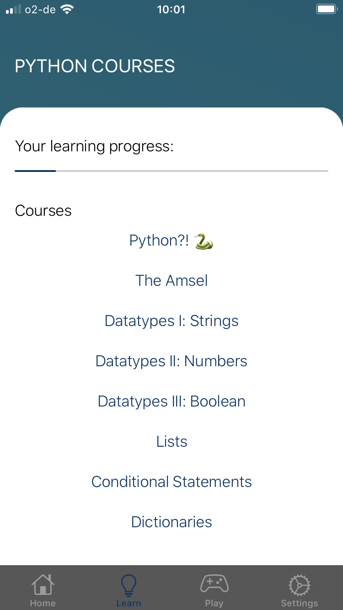
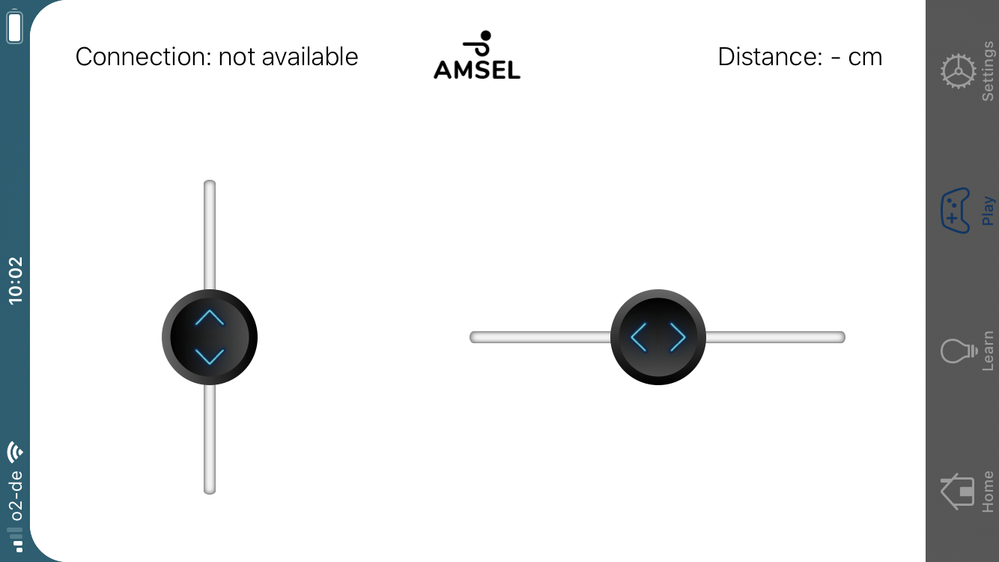
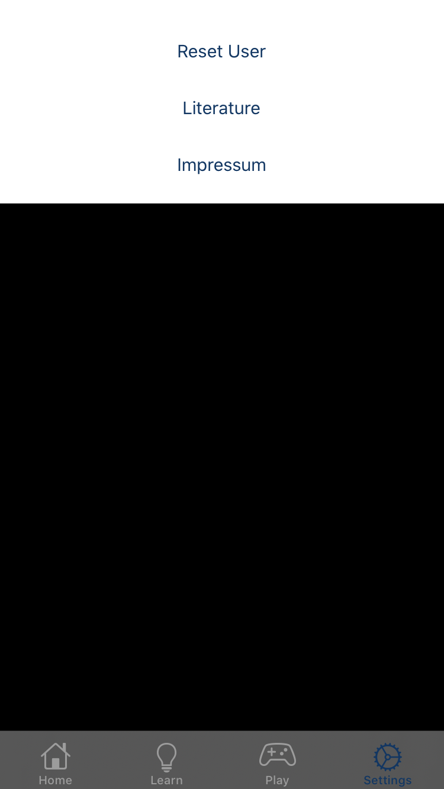

# About

## Members

### [Moritz Gut](https://github.com/moritzgvt)

**Project Management & Interface**  
Information Design  
University of Media Stuttgart

### [Anja Stütz](https://github.com/anjastvtz)

**Software & Application Development**  
Information & Science  
University of Media Stuttgart

### [Vincent Wengert](https://github.com/Vincent-Wengert)

**Software & Hardware Development**  
Business Information Systems  
University of Media Stuttgart

### [Tobias Moser](https://github.com/Tobias-Moser)

**Software & Hardware Development**  
Business Information Systems  
University of Media Stuttgart

### Lecturers
- #### [Dr. Kai Eckert](https://www.hdm-stuttgart.de/studieninhalte/person_view_kuerzel?kuerzel=eckert)
- #### [Magnus Pfeffer](https://www.hdm-stuttgart.de/studieninhalte/person_view_kuerzel?kuerzel=pfeffer)
- #### [Andreas Stiegler](https://www.hdm-stuttgart.de/person_view_kuerzel?kuerzel=stiegler)

## Project

[[toc]]

### Proposal

**"Robots for everybody" – Build a robot for freshmen students to learn python from.**  
The delivery requirements of the course "Robot Didactics" were very openly defined. The aim of the course: To use robotics to introduce freshmen to the programming language Python. It was up to the students to decide whether this was actually a physically built robot or a didactic concept at the end of the semester.

## Project documentation

### First steps

The group started the product conception with the help of a general brainstorming and idea collection. An overview was gained of what was required and with which ideas these requirements could be achieved. In addition, the focus was on incorporating the ideas of each group member in order to establish a common basis. This approach worked well, as it turned out in this phase that all group members had different ideas about the project goal, but would choose a similar approach. As a result, individual roles and focal points for each group member crystallized directly, and an interdisciplinary and diverse approach that would also characterize later group work emerged.

### The idea

In order to set the first cornerstones of the project goal, an easy and fast method from Design Thinking was used. For this method (_"Speedy 8"_), you divide a sheet of paper into eight equally sized rectangles and then try to roughly capture one idea per rectangle within 30 seconds - either graphically or textually. The important thing is that there are no bad ideas. Then the group presents their ideas in turn. During this time, questions can be asked and ideas can be explored. In order to identify the best and most popular ideas and to be able to deepen the discussion, a further evaluation method was used. Each participant is given three points, which can be freely distributed among the individual ideas.

The following lists the results (Goals) from these methods:

:white_check_mark: **1.0 Extensibility**  
  :negative_squared_cross_mark: 1.1 Generate a "learning effect" through tinkering  
:white_check_mark: **2.0 Remote control**  
:white_check_mark: **3.0 Beautiful chassis**  
:white_check_mark: **4.0 "Mars Rover"-Control**  
  :negative_squared_cross_mark: 4.1 "Labyrinth", automatic drive  
:x: _5.0 Upright positioning of the robot._  
  

  
:white_check_mark: **implemented** | :negative_squared_cross_mark: partially implemented | :x: _not implemented_

### Aggregated Objective

Development and conception of a self-construction robot kit for the teaching of programming basics in the first semester Information System of the Information Science program. 
The robot is remote controlled via an interface (web or mobile application). The students program the robot's movements themselves to learn how to use Python. Depending on the use case, the robot can be extended, for example with a pen for Turtle Graphics. The robot should stand upright and should have a display and, if necessary, LEDs to appeal to the students to increase acceptance. 
A quick start guide helps the students to build the robot and to solve problems (e.g. network errors) by themselves.

### Market Research

During the research phase, the findings were mainly based on an analysis of comparable robots, all of which were extremely expensive to purchase and seemed to offer little or no added value compared to the final solution presented. In addition, loose qualitative surveys were conducted from time to time, which were not documented, but helped us a lot in our decision making.

### Hardware Research

After a rough implementation idea had emerged from the knowledge gained, possibilities were researched to implement it - most importantly at low cost. A mistake during this research phase was the decision for a board including a battery, which however did not provide enough voltage to operate motors – as was noticed later during the prototyping phase. This mistake cost the team the reaching of goal 5.0.

### Implementation

The group met on regular weekly all-day meetings to ensure the successful implementation of the above-mentioned objectives. Thanks to the general commitment and the weekly "block appointments", the numerous problems that arose could be solved quickly and to the overall satisfaction of everyone. The fruits of this work can be found on the Github repository and website, which was also created during this process. 

Versioning the project work on Github was also a good decision, which should pay off in the later course of the project. To achieve a clean separation from our private github accounts we created an [Organization](https://github.com/baumeise) which contains all relevant repositories.
  

  
### Final delivery  

The finally delivered product was a DIY 3D-printed robot including everything from [building instructions :clipboard:](https://baumeise.github.io/amsel/instructions) to its [open source firmware :file_cabinet:](https://github.com/baumeise/amsel) as well as an [iOS application :iphone:](https://github.com/baumeise/app), [detailed developer docs :vhs:](https://baumeise.github.io/amsel/getting-started) and an indexed [python package :package:](https://pypi.org/project/amselpy/).
  
Further information are provided on the [documentation page](https://baumeise.github.io/amsel).

### Outview

There are many ideas for the further development of the created product. Not least because an intensive examination of a topic always generates new ideas and approaches. Here are some initial suggestions for how the robot could be further evolved:

- Storage of the entered Python commands to establish programmability.
- Code input via web interface
- Extended communication via the display and implementation of further communication possibilities (e.g. sound)
- Significant improvement of the UX. During construction as well as during setup and use.
- Implementation of further sensor technology (e.g. location via wifi or bluetooth)
- Voice control - possibility to set your own voice commands
- Communication between robots (e.g. swarm functionalities)
- Enhanced autonomous drive

## Didactic concept

::: tip How freshmen will learn 
The didactic approach and concept for the Amsel robot and the Amsel mobile application
:::

### Research and identification of needs

As the amsel robot shall support freshmen students in their aim to learn python programming by themselves, the didactic concept of the robot is based and orientated on their needs and working methods. To develop a fitting didactic concept for this target group, the design thinking method of a persona was used:

> “Programming is too complicated for me!”

- Lisa, 21
- Student 1. Semester Information Science
- Has nearly no previous knowledge about programming 
- Thinks that programming is too much technical, too much math and overall too complicated
- Problems with the flipped classroom model 
  - Low motivation to learn everything by herself 
  - Too many other projects and classes with dues
- Hobbies: Social media, reading, going out with friends, watching movies and series

To identify the needs further, the outcomes of the last evaluations amongst information science students and the previous topics of information systems were examined.
  
Outcomes of the last evaluations of information systems:

- „IT: **zu schwierig, zu aufwendig**“ (WS 2017/2018))
- „Nochmals einige **Grundlagen** wiederholt, echt top!“ (WS 2017/2018)
- „Sehr IT-lastig“ (WS 2017/2018)
- „In IT sollten „**wirkliche Grundlagen“** vermittelt werden“ (SS 2019)
- „Besser im 1. Semester Web-Technologie und erst danach Python“ (SS 2019)
- „Keine **Vertiefungsmöglichkeiten** in IT“ (SS 2019)
- „Programmieren „**besser erklären**““ (WS 2018/2019)

Other didactic robots work with mobile applications for steering and learning approaches. Furthermore there are many high ranked applications, which teach users a wide range of topics from technology to languages. As the Amsel robot also shall have a remote control, the decision was to develop a mobile application which combines didactic lessons, the possibility to connect with the Amsel and a remote control. 

### Chapters and lessons

The Amsel didactic is based on ten chapters with five to twelve small lessons inside. As requested in the evaluations, the main focus of amsel is to teach the basics fast and make programming through the interaction with the robot entertaining and fun. Combined in a mobile application, the students have the lessons on their phone and can learn when and where they want. As the interaction with amsel is limited to the last tasks, the complete theoretical part can be completed on the go. To support the fast, easy and flexible learning style, the lessons are short and can be completed in some minutes and so increasing the motivation of the students to learn. A progress bar displays the overall learning progress of the user.

Each Lesson consists of a short theoretical input, followed either by a code example or a task and response if the task is completed right or wrong. There are mainly two types of tasks:

- Multiple Choice: User has to choose between one or more options to complete a task
- Code Gaps: User has to fill in gaps and complete code examples. 
- Amsel Lessons: User has to fill in gaps. The output is then displayed on the screen of the amsel robot or let it perform a certain action (e.g. move forward while no barrier is in front).
  

  

  

  
### Lesson overview

|     | Chapter          | Description                                                  | Lessons                                                                        |
| --- | ---------------- | ------------------------------------------------------------ | ------------------------------------------------------------------------------ |
| 1   | Python?! :snake: | Introduces the user to python as a new programming language. | Python \ The start \ A new language \ Hello Amsel \ The developing environment |
| 2  | The Amsel | Introduces the user to the amsel robot and the right setup, especially beyond the mobile application with the hint to learn and train even outside the app. | Setup of Amsel \ Amsel connection \ From amselpy import Amsel \ Amsel instance \ Amsel functionalities |
| 3 | Datatypes 1: Strings | Introduces the user to variables and strings. The user learns the right naming, storing values and what makes a string a string | Variables \ The right naming I \ The right naming II \ Values \ Strings I \ Strings II \ Adding strings to a variable \ Amsel \ Recap |
| 4 | Datatypes 2: Numbers | Introduces the user to the datatype numbers and teaches them to handle and work with them properly | Numbers \ Integers \ Float \ Adding numbers \ Substract numbers \ Multiply numbers \ Devide numbers \ Amsel \ Recap |
| 5 | Datatypes 3: Boolean | Teaches everything about Booleans and conditional tests. | True or False \ Comparisons I \ Comparisons II \ Comparisons III \ Comparisons IV \ Amsel \ Recap |
| 6 | Lists | Teaches the user the basics about lists and tuples, as well as how to work with them. | Lists \ Datatypes \ Index I \ Index II \ Length \ More Items \ Insert \ Removing \ Slicing \ Tuple \ List & Tuple \ Amsel \ Recap |
| 7 | Conditional statements | Repeats Booleans and conditional tests and later introduces the user to conditional statements. | Remember the Booleans? \ If… \ If… \ Compare it! \ Else \ Elif \ Lists \ Amsel |
| 8 | Dictionaries | Teaches the user all about dictionaries and how to work with them. | Dictionaries \ Keys & Values \ Accessing a Value \ Keys \ Length \ Add \ Update \ Remove \ Amsel \ Recap |
| 9 | Loops | Teaches about while and for loops and the possibility to use them for lists and dictionaries | Loops \ While Loops I \ While Loops II \ While Loops III \ For...in \ Loops & Lists I \ Loops & Lists II \ Loops & Dictionaries I \ Loops & Dictionaries II \ Loops & Dictionaries III \ Amsel \ Recap |
| 10 | Functions | Short introduction into functions. Build-in functions as well as custom functions. | Functions \ Custom Functions \ Recap \ Amsel |

### The mobile application

The Amsel application is built for iOS devices with iOS 13 and upwards. The IDE is XCode with the programming language Swift and the app was tested in the Simulator, as well on the iPhone 11 Pro and iPhone SE. The test on multiple devices ensured the responsive screen design.

### The Application Architecture

The first entrance for the user is the splash screen, which is displayed while the application is loading in the background. When loading is finished, the homescreen, as well as a menu at the bottom are displayed. The menu is always visible and allows the user to switch quickly between the four menu items: 

- **Home:** Homescreen with a quick introduction and the possibility to connect to the Amsel robot
- **Learn:** Contains all learning courses and lessons
- **Play:** Remote control with sliders and the display for the measured distance
- **Settings:** Allows the user to rest the learning progress, but contains also the imprint and literature tips

  

### The Home Screen

  The home screen gives an entry point to the application and gives a quick introduction to Amsel. Also it is possible to connect with amsel through the home screen, just by clicking on a button. The interface of the home screen, as well as all other screens are the same like the official amsel CI to have a recognition value through the whole project. 

  

  

  

  

  

### The Learn Screen

  The learn screen contains an overview of all courses, as well as the progress bar which was mentioned before. The user must not start with the first lesson. This allows even advanced users or users with little prior knowledge to start at their level.

#### The lessons

  Programmatically the lessons view differs from the other ones, as the components are not the same for every view. They can change - sometimes there are multiple choice exercises, code gaps or only code examples and sometimes there is feedback and sometimes not. To avoid redundancy and to simplify, but also to make the whole construct as expandable as possible, the lessons are stored in a json file. With that, it is possible to add new or change already existing lessons as fast as possible. The lessons view can load the json and will display the right components if they are not null in the json file. Furthermore, another big benefit of the json format is that other applications can easily also load and use it, as it is not iOS or swift specific.

  

  

  

  

The json structure is as following: 

- **id:** GUID – unique identification number of the lesson or the chapter. Allows to refer to a specific lesson. Is not displayed to the user.
- **index:** number of the lesson or the chapter. 
- **title:** title of the lesson or the chapter. 
- **task:** Theoretical input of the lesson (written in HTML format). 
- **multipleChoice:** Defines the multiple choice task, which can be either true or false. multipleChoice can be null if not used. 
- **codeBlock:** Contains the code example (type code) or a gap which has to be filled by the students with content (type gap), as well as the corresponding output (type output). Can be null if not used. 
- **feedbackFailed:** Is only displayed if either the multiple choice task or the code gap were wrong. Contains feedback for the student, with hints and tips to do better. Can be null if not used. 
- **feedbackPassed:** Is displayed either when a task was fulfilled correctly or to give the student bonus information after a lesson. Can be null if not used. 
- **amselAction:** Contains the interface to the amsel robot and allows the user to display task results on the robot when fulfilled correctly or even Amsel interactions can be selected. Can be null if not used. 

To avoid the students just clicking through the lessons without thinking about the content, a mechanism is built in, which only allows to carry on, if the lesson is fulfilled correctly.

### The play screen

The play screen allows the user to play with the functionalities of Amsel. The user can control the amsel robot through two sliders. The left one allows the user to move the Amsel forward and backward. The right one moves the Amsel to the right or left. It also displays if the Amsel robot is correctly connected with the mobile application and the distance, which is measured by the Amsel’s ultrasonic sensor.

  

### The Settings Screen

Allows the user to reset their progress with the lessons. Besides that, the impressum and literature is listed in the settings section. 

  

  

  

  

