# Building Instructions

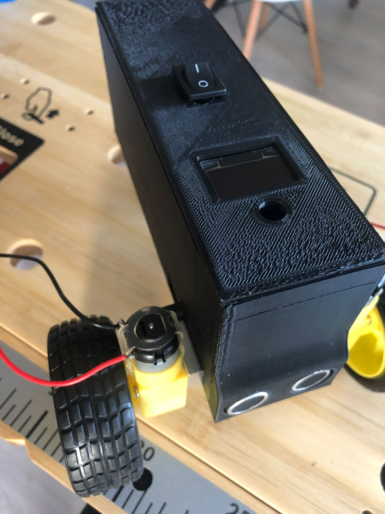

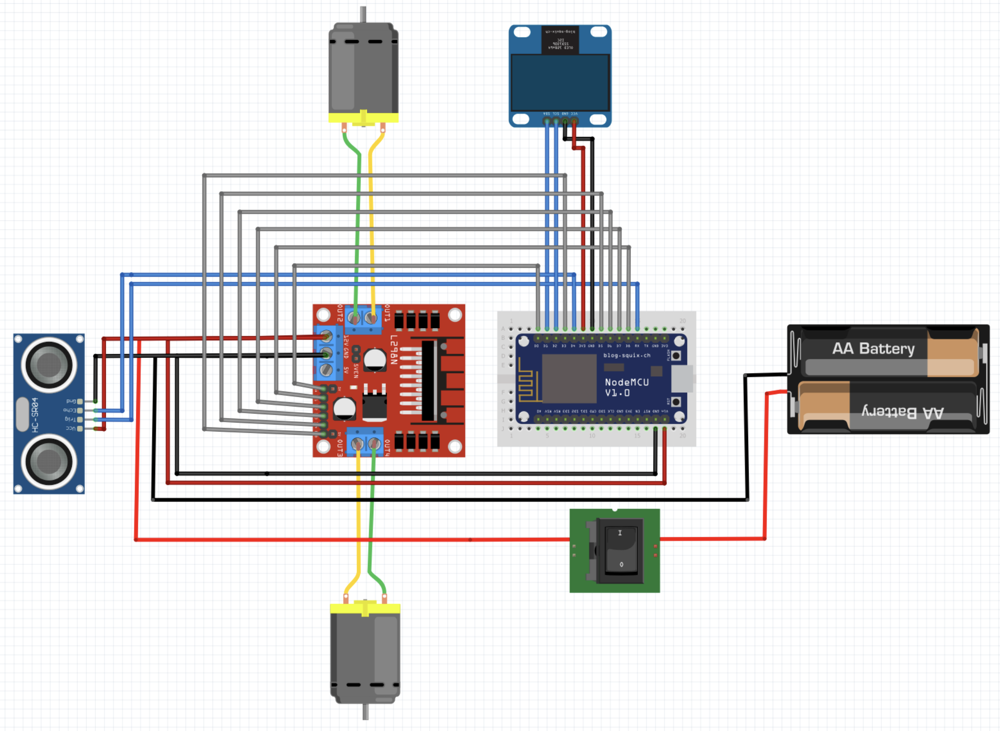

**Difficulty:** medium | **Time:** 60 minutes

[[toc]]

## Overview
Development and conception of a self-construction kit for a robot for the teaching of programming basics in the 1st semester Information System of the Information Science programme.  
The robot is remote controlled via an interface (web or mobile application). The students program the robot's movements themselves and learn how to use Python. Depending on the use case, the robot can be extended, for example with a pen for Turtle Graphics. The robot should stand upright and should have a display and, if necessary, LEDs to appeal to the students to increase acceptance.  
This building instruction helps the students to build the robot by themselves.

## Tools & Materials

| Tools          | Materials                           |
|----------------|-------------------------------------|
| Soldering Iron | 1x 3D printed Amsel Chassis + Cover |
| Screwdriver    | 2x 3V - 6V 2 axis TT Motor + Wheels |
| Pliers         | 1x L298 Dual H-Bridge               |
| Sticky Tape    | 1x Powerbank 5V-OUT/Battery-Case    |
| 3D Printer     | 1x USB Charging Cable               |
|                | 1x 0,96 inch OLED I2C Display       |
|                | 1x HC-SR04 Ultrasonic Sensor        |
|                | 1x ESP8266 microcontroller          |
|                | 1x free spinning wheel              |
|                | 1x On/Off Switch                    |
|                | 2x Screws + Nuts (M4x35)            |
|                | Many Jumper Wires                   |

::: tip
See the [hardware page](/hardware/) for reference what materials we used.  
:::

### Necessary preparatory work

Before you can start assembling the robot, there are some necessary preparations to be done:

1. **Charge the powerbank**, so you're able to test the robot after assembly.  
1. The **chassis as well as the lid should already have been printed** with the 3D printer.  
1. **Solder a cable to each of the two contacts of the DC motors**, if not already existing.  
1. **Cut off a 20cm piece of the USB charging cable**, starting from the USB connector. The piece should now be stripped at least halfway to expose the wires inside. Only the red and black wires are needed, depending on the USB cable.  

### Assemble the robot

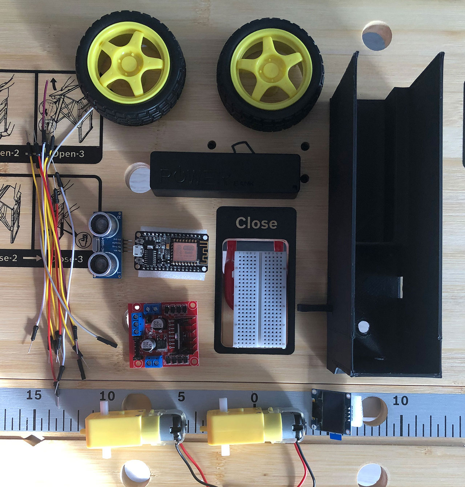

### 1. **Ultrasonic sensor**  
First you put the chassis of the robot in front of you. The first part to be installed is the ultrasonic sensor, which is located at the front of the chassis. Before you can insert it into the chassis, connect a cable to each of the four connectors of the sensor. Then carefully insert the sensor into the chassis via the guide rails provided and place it in the holes provided.

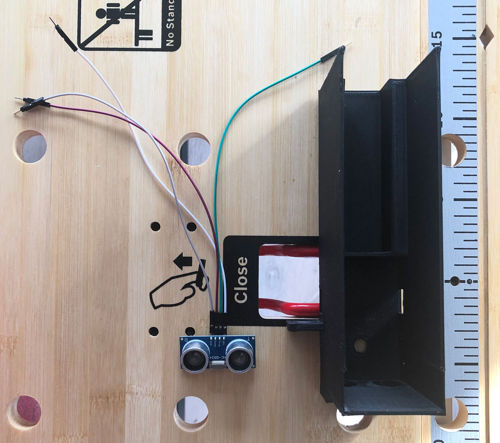

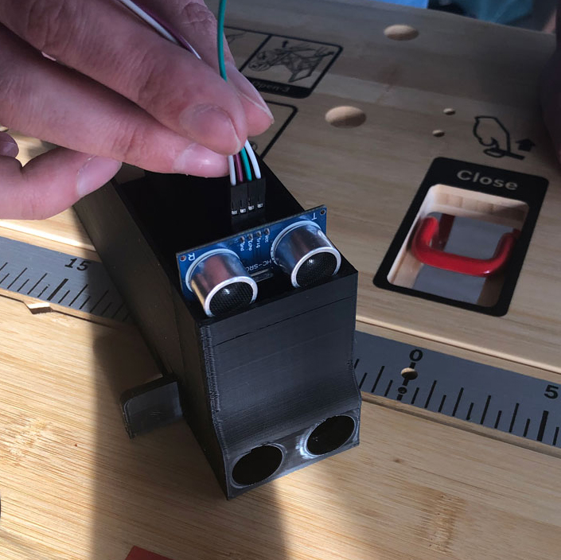

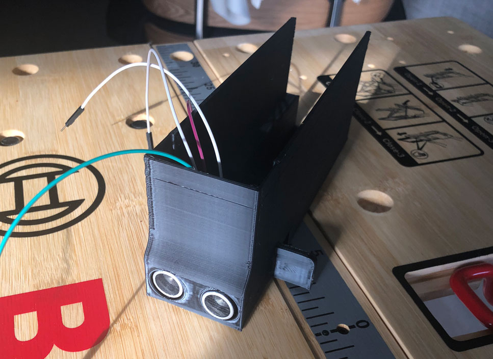

### 2. **DC Motors**  
Next, take the two DC motors and place them on the chassis with the contacts facing outwards. Then you can fix the motors to the chassis with the corresponding nuts and bolts. Once the motors are attached to the chassis, you can plug the two wheels into the motors. 

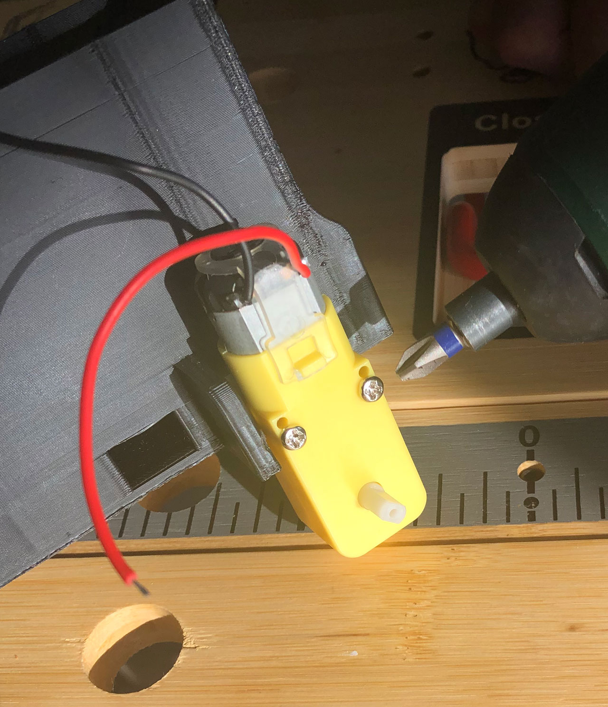

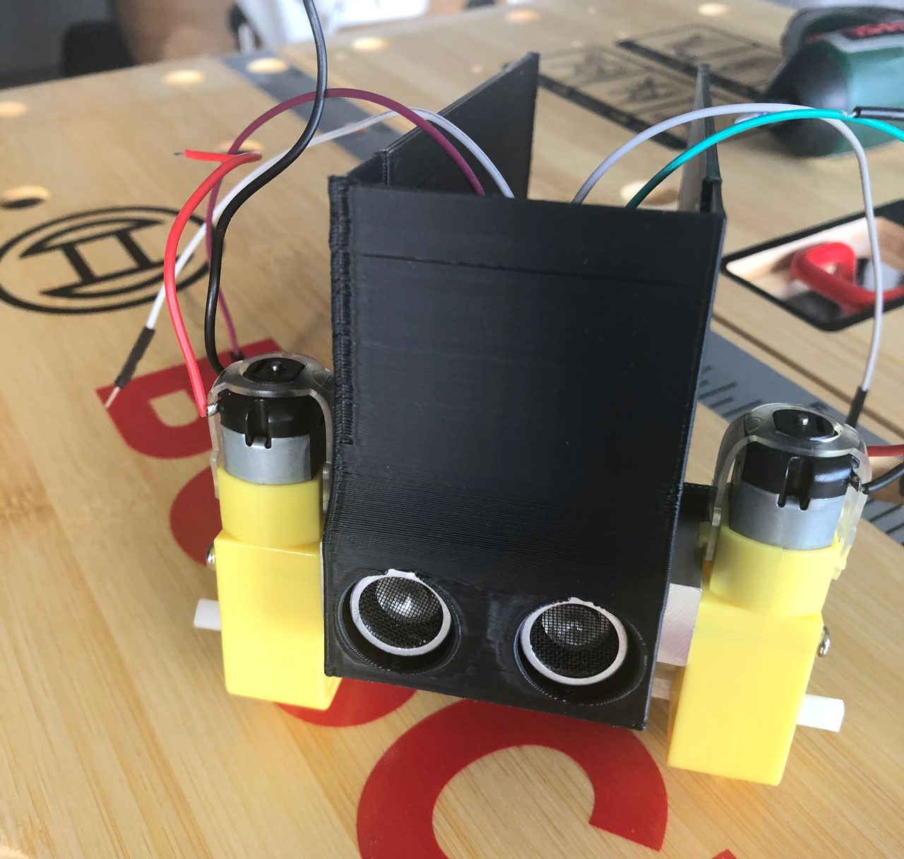

### 3. **Back wheel**  
Take the freely rotating wheel and stick double-sided adhesive tape on the underside of the wheel. The wheel can then be attached to the chassis.

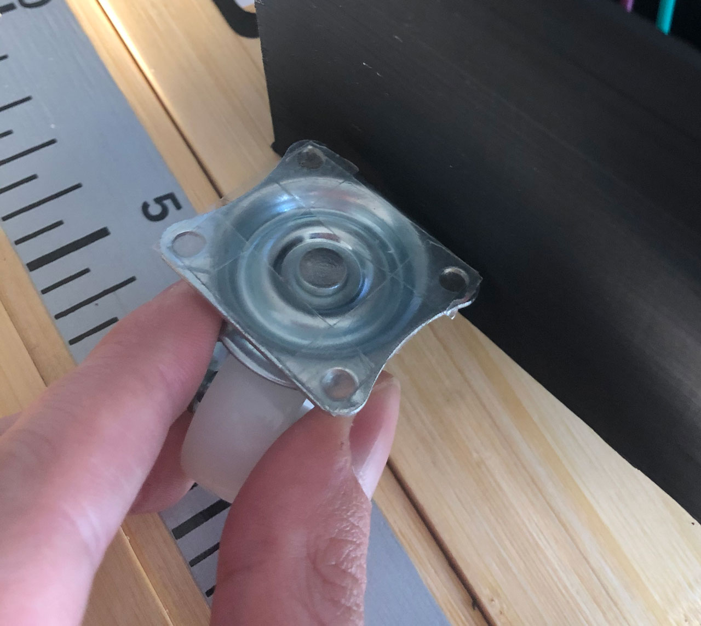

### 4. **Powerbank**  
Afterwards take the loaded powerbank and place it in the recess provided in the chassis.

### 5. **ESP8266**  
Then take the ESP8266 microcontroller and plug it into the breadboard. 

::: danger Attention
There should be at least one free row on the breadboard to plug in cables. If not, the breadboard must be cut in half.
:::

The other components of the robot, such as the OLED display, the H-bridge and the ultrasonic sensor already in the chassis, are wired as follows:

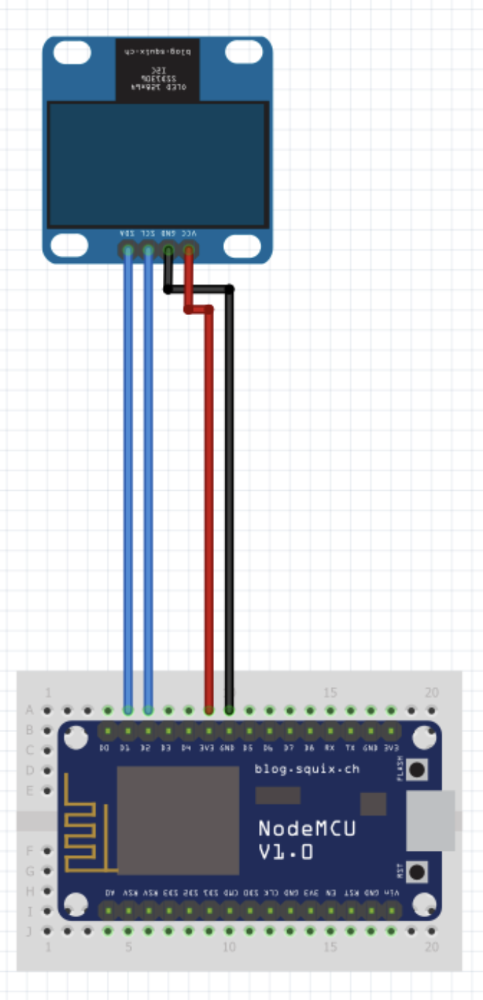

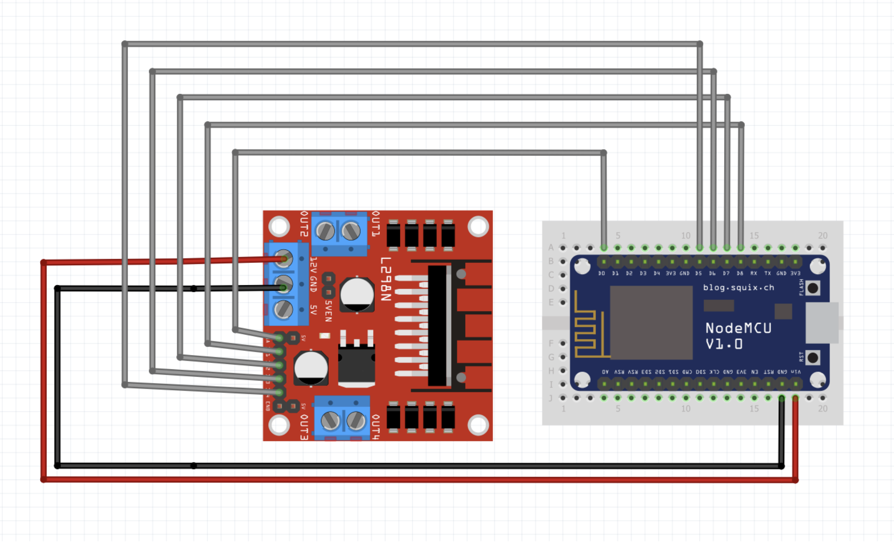

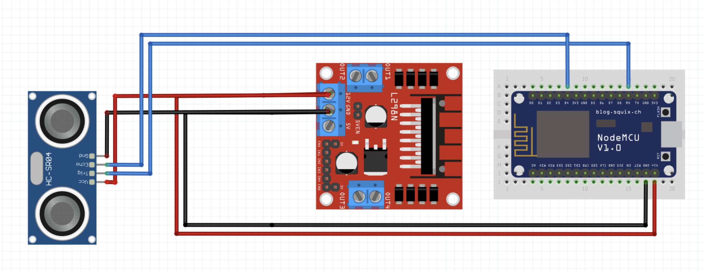

| Display | ESP8266 |
|---------|---------|
| GND     |     GND |
| VCC     |     3V3 |
| SDA     |     D2  |
| SCL     |     D1  |

| H-Bridge | ESP8266 |
|----------|---------|
| GND      |     GND |
| 12V      |     VIN |
| ENA      |     D0  |
| IN1      |     D8  |
| IN2      |     D7  |
| IN3      |     D6  |
| IN4      |     D5  |

| Sensor | H-Bridge | ESP8266 |
|--------|----------|---------|
| GND    | GND      |         |
| VCC    | 12V      |         |
| Trig   |          | RX      |
| Echo   |          | D4      |

### 6. **Switch** (optional)  
After everything is wired up, take the lid of the robot and stick the OLED display from below with adhesive tape in the provided recess. Then place the switch on the lid. The switch must now be connected to the H-bridge and the USB charging cable (in this case the battery) as follows: 

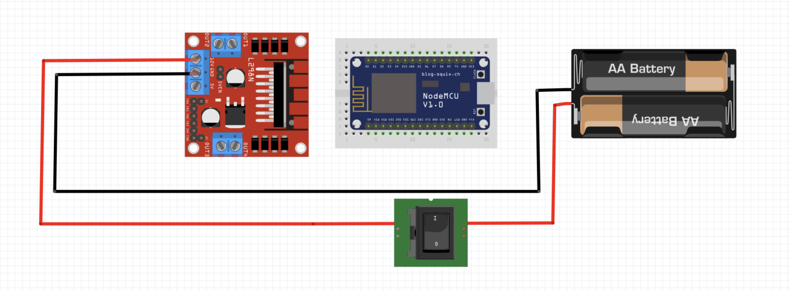

### 7. Placing the wired components
As a last step, place all components in the designated places in the chassis and fix the lid on the robot. 

::: tip 
**Wire handling**  
To arrange the cables a little bit better it can be useful to bundle them with some tape and glue them to the inner wall of the chassis.
:::

After that you only have to connect the cables of the motors to the H-bridge. Then you can transfer the firmware to the robot via USB on the ESP8266. 

::: danger Attention
When flashing the robot, never connect it to the power supply, otherwise it may cause a short circuit and destroy individual components of the robot.
:::

After that, the robot is ready for use.

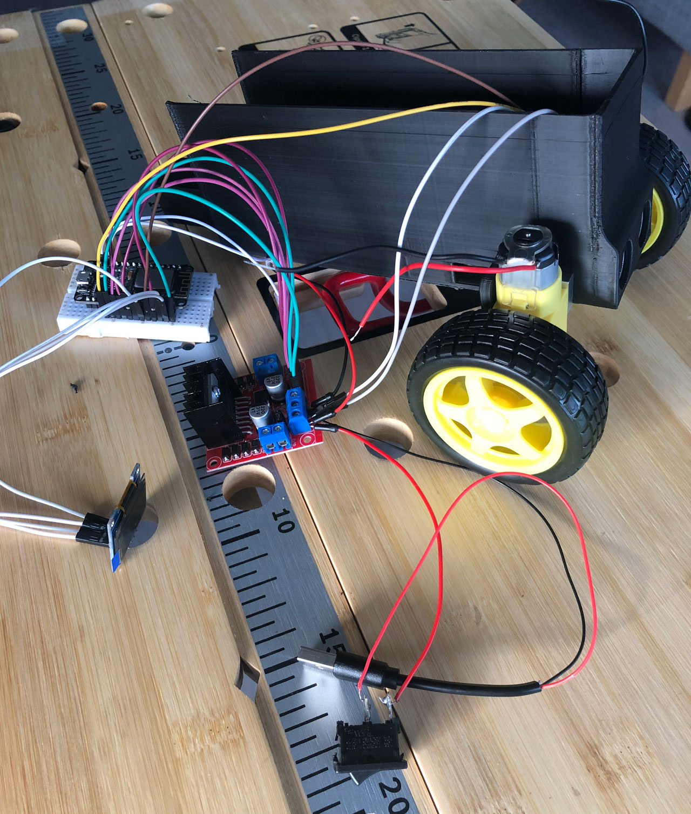

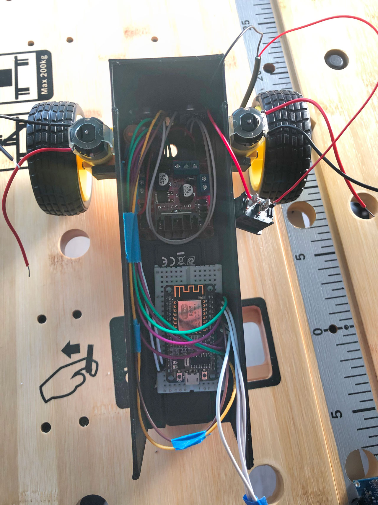

